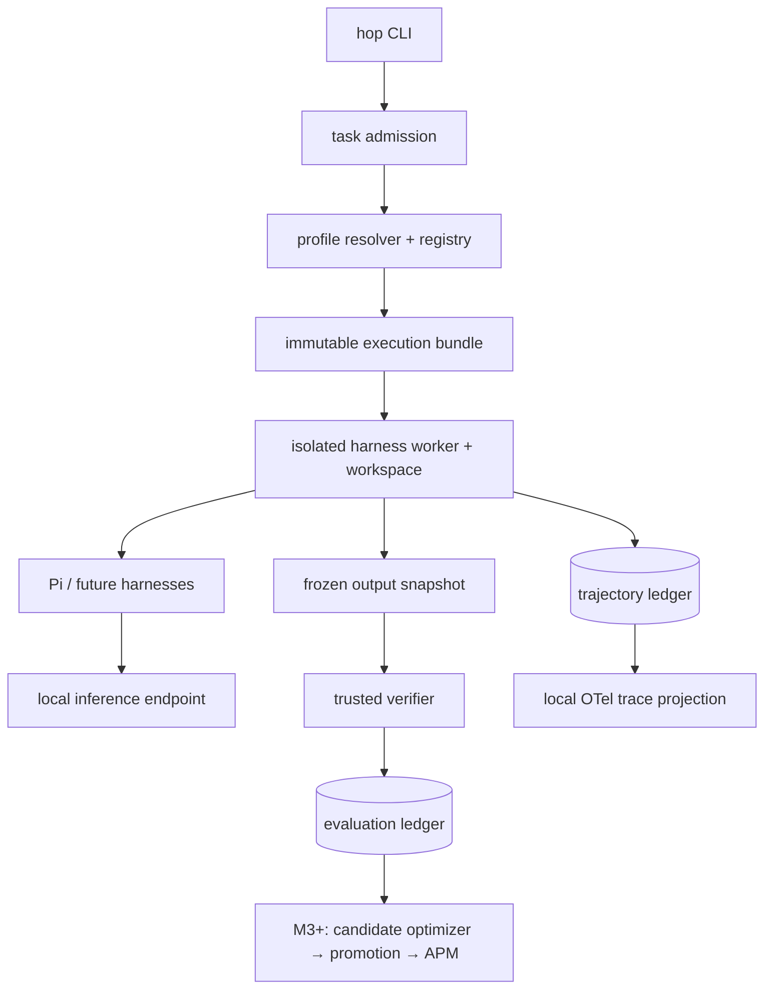

# HOP

**Harness Optimization Platform.**

A CLI-first tool for one developer doing local coding. One machine, local
models, local repositories, SQLite, and files. No accounts, teams, tenants,
enterprise settings, cloud services, or required dashboard stack.

HOP evaluates and eventually optimizes complete local coding-agent
configurations across models, harnesses, skills, prompts, tools, and runtime
settings.

`master` is the default development branch. It contains work in progress,
not a release-qualified optimization system. Use the milestone acceptance
records to distinguish delivered behavior from planned capabilities.

## Core idea

```text
model
+ harness
+ system prompt
+ skills
+ tools
+ runtime configuration
        ↓
       HOP
        ↓
observe -> verify -> compare
        ↓
future: optimize -> confirm -> activate locally -> rollback

optional: export a locked profile with APM
```

HOP binds one immutable **execution bundle** — model deployment, harness
build, prompt, skills, tools, and runtime configuration — to every run,
observes the trajectory, and judges the outcome with a trusted verifier in a
separate process. Optimization, local activation, and rollback remain planned;
the current system records and compares evidence without claiming improvement.

## HOP is not another coding-agent harness

HOP operates **above** harnesses such as:

- Pi
- Prime Agent
- OpenCode
- DeepSeek Harness

It does not replace their agent loops. It wraps their headless interfaces,
runs them in isolated workspaces against local models, and records what
happened. Only the Pi adapter is implemented; the others are optional future
integrations (M5), not requirements for local coding with Pi.

```text
HOP
  evaluate
  observe
  qualify
  optimize
  promote

APM
  package
  lock
  distribute
```

APM is an optional packaging/export layer, not the optimizer
itself. M3 implements the HOP-to-APM export as a distribution target; HOP
remains authoritative for profile, component, and evaluation identity.

Current scope is **local models and local inference only**. Supported/target
model families are DeepSeek, Qwen, and GLM. There is no hosted API fallback.

## Status: alpha / active development

The HOP 0.2 foundation review is **in progress, not release-qualified**.
The CLI/devex and integrity changes have non-live regression evidence; open
security findings, independent review, offline type tooling, and current live
qualification still block advancement to M4. Start with the
[runbook](docs/runbook.md), [review](docs/foundation-review.md), and
[acceptance matrix](docs/acceptance-foundation.md).

Latest recorded scope validation: **284 non-live tests passed**, with lint and
formatting passing. Type checking remains blocked on approved offline tooling;
current Pi/local-model qualification and independent boundary review remain
outstanding. See [the validation report](docs/single-user-delivery.md). A merge
into `master` does not waive these gates or authorize M4 to begin.

Implemented (M0–M3 plus the AOP → HOP rename):

- local-only execution foundation (loopback enforcement, served-model
  attestation, no cloud fallback)
- trusted independent verification (machine-readable per-test report, pinned
  expected tests, isolated verifier worker)
- immutable execution identity (bundle digest on every run and event)
- trajectory capture (schema-valid events, per-source sequences, dedup, gap
  detection)
- OpenTelemetry observability (local tracing, disk spool/recovery)
- trace/trajectory correlation
- telemetry completeness (outcome-aware policy; incomplete runs cannot pass)
- secret redaction and data classification
- replay metadata and checks
- HOP CLI (`hop`; deprecated `aop` alias retained through 0.2)
- Pi integration (headless JSONL adapter; historical probes qualified 0.85.1,
  not the latest observed 1.0.0 build)
- immutable versioned component registry (prompts, skills, agents, policies,
  overlays, hooks, MCP) with content-addressed identity and tamper detection
- deterministic profile resolution, lockfiles, variant selection, and
  classified policy merge
- deterministic profile compiler with a real Pi target
- APM export with HOP provenance and round-trip verification

Planned (not implemented — automatic optimization does not exist yet):

- local coding, debugging, diff-review, and test/dependency evaluation packs
- additional harness adapters (Prime Agent, OpenCode v2, DeepSeek Harness)
- model qualification
- skill/prompt optimization
- dynamic profile optimization
- owner-confirmed local activation, trial tasks, and rollback

## Roadmap

| Milestone | Scope (per `BUILD_PLAN.md`) | Status |
|---|---|---|
| M0 | Contracts, threat model, compatibility discovery | ✅ done (`m1-foundation` tag covers M0) |
| M1 | Minimal vertical slice: Pi + local model + verification | ✅ done (`m1-foundation`) |
| M2 | Trace and trajectory evaluation | ✅ done (`m2-observability`) |
| — | AOP → HOP namespace migration | ✅ done (`hop-namespace`) |
| M3 | Canonical skills, compiler, and APM | ✅ done (profiles/compiler/APM) |
| Foundation | HOP-R01-R05 review and simplification | In progress; acceptance blocked |
| M4 | Local coding evaluation packs | ⬜ blocked on foundation |
| M5 | Optional harness integrations | ⬜ planned |
| M6 | Model matrix and fair benchmarking | ⬜ planned |
| M7 | First optimization loop | ⬜ planned |
| M8 | Owner-confirmed local activation and rollback | ⬜ planned |
| M9+ | Dynamic routing / lifecycle hardening | ⬜ planned |

## Architecture



Trust boundaries (see `docs/threat-model.md`): the control plane, the agent
worker, and the verifier worker run in separate `bwrap` mount/PID namespaces
with separate filesystems and credentials. The verifier reads a frozen
snapshot plus one hidden case; the agent worker cannot see hidden tests, the
repository, or other runs. Inference endpoints must resolve to loopback.

## Local developer setup

The evidenced offline combination is Python 3.14 on Linux x86-64, plus an
approved wheelhouse. Live execution additionally requires a qualified Pi
build, `bwrap`, and a registered local model. Other combinations require
qualification before support is claimed.

```bash
git clone --branch master https://github.com/mitkox/harness-opt.git
cd harness-opt
HOP_WHEELHOUSE=/path/to/approved/wheels scripts/dev bootstrap
./hop --help
scripts/dev test --suite all
scripts/dev check
```

Bootstrap stages a versioned environment and switches `.venv` only after
validation. Existing environments are retained. `--runtime` omits developer-only
schema tooling but retains pytest for trusted verification; `--run-tests`
validates a developer environment before switching.
No manual `PYTHONPATH`, editable install, or package download is required.
Static type checking currently reports blocked pending approved offline tools.

Register the machine's real deployments and harnesses:

```bash
PYTHONPATH=src .venv/bin/python scripts/discover.py
./hop discover
```

`profiles/models/local-inventory.json` and
`profiles/harnesses/local-inventory.json` are machine-local state regenerated
by `scripts/discover.py`. Synthetic placeholders for new contributors live in
`examples/local-model-deployment.example.json` and
`examples/pi-harness.example.json`; the two synthetic benchmark cases are
`benchmarks/development/debug-offbyone` and `benchmarks/development/debug-wordcount`.

## Usage

The current CLI has real nested command groups:

```bash
./hop doctor
./hop init
./hop deployment list

# M3: components, profiles, compiler, APM
./hop registry import components
./hop component list --type skill
./hop profile validate examples/profiles/coding.yaml
./hop profile explain examples/profiles/debugging.yaml
./hop profile lock examples/profiles/coding.yaml --out /tmp/coding.hop.lock
./hop profile compile examples/profiles/coding.yaml --out /tmp/pi-out
./hop run start --case debug-offbyone --model REGISTERED_DEPLOYMENT
./hop profile export examples/profiles/coding.yaml --target apm --out /tmp/apm
./hop profile verify-export /tmp/apm --profile examples/profiles/coding.yaml

# run investigation
./hop run list
./hop run show RUN_ID
./hop run trajectory RUN_ID --cursor 0 --limit 100
./hop run completeness RUN_ID
./hop run replay-check RUN_ID
./hop run compare LEFT_RUN RIGHT_RUN
```

More investigation verbs: `artifacts`, `trace`, `verify`, `skills`, `tools`
(for example `./hop run trace RUN_ID`). Redirected output defaults to JSON;
use `--format text|json` to choose. See the runbook for path precedence and
exit codes. Legacy command forms, `aop`, and `AOP_*` remain through 0.2;
removal is targeted for 0.3 only after M4 acceptance and migration documentation.

A passing run ends with `outcome: pass` and `verdict: pass` from the trusted
verifier; agent text claiming success never decides the result. Failing runs
(for example the unpatched baseline) end with `outcome: fail`. Every run
leaves a complete trajectory under `runs/<run-id>/` (gitignored local state),
with sample evidence committed under `docs/evidence/`.

## Repository layout

```text
src/hop/            control plane, runner, verifier, telemetry,
                    registry/resolver/compiler/apm modules
components/         canonical M3 component sources (prompts, skills, agents,
                    policies, overlays, hooks, MCP)
adapters/           (reserved; Pi adapter lives in src/hop/harnesses/)
benchmarks/         synthetic development cases
.hidden/            interim hidden-test store (namespace-enforced; M4 moves
                    this to evaluator-owned sealed storage)
.hop/               local HOP home (gitignored): registry, profile store,
                    compiled artifacts, exports
profiles/           machine-local model/harness inventories (discover.py)
examples/profiles/  example workflow profiles (fixtures, not optimized)
specs/              JSON schemas
docs/               runbooks, acceptance matrices, ADRs, threat model
scripts/            discover, lock-env build, acceptance, M3 demo
tests/              unit, contract, security, and e2e tests
```

## Known alpha limitations

- Only the Pi adapter is implemented; Prime Agent, OpenCode v2, and DeepSeek
  Harness are discovered/blocked, never auto-qualified. They exist as
  fail-closed compiler extension points in M3.
- No automatic optimization yet: no candidate generation, no GEPA backend,
  no promotion. M3 adds profiles, deterministic compilation, and APM export
  only.
- Exported APM provenance is tamper-evident (digests) but not signed;
  signing infrastructure is outside the single-user scope.
- `.hidden/` is an interim in-repo hidden-test location enforced by mount
  namespaces, not sealed evaluator-owned storage (M4).
- Isolation uses `bwrap` namespaces. The Pi worker shares host networking;
  inference endpoint checks do not enforce general OS-level worker egress.
  Aggregate descendant quotas and verifier current-case protection also remain
  open security findings. Do not treat this as hostile-workload qualification.
- PostgreSQL, multi-node scheduling, remote publishers, and organizational
  administration are out of scope, not deferred requirements. See
  [the single-user decision](docs/adr/ADR-011-single-user.md).

License: Apache-2.0 (`LICENSE`). Security reports: see `SECURITY.md`.
Contributions: see `CONTRIBUTING.md`.
