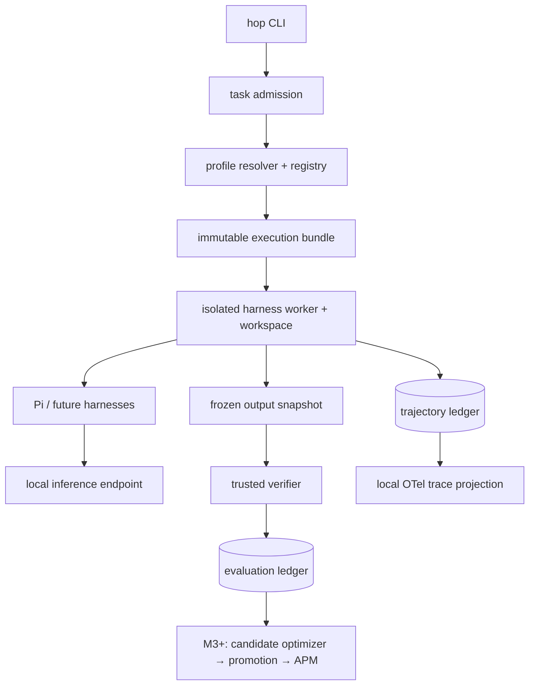

# HOP

**Harness Optimization Platform.**

HOP evaluates and eventually optimizes complete local coding-agent
configurations across models, harnesses, skills, prompts, tools, and runtime
settings.

## Core idea

```text
model
+ harness
+ system prompt
+ skills
+ tools
+ runtime configuration
        ↓
       HOP
        ↓
observe
evaluate
qualify
optimize
promote
        ↓
       APM
        ↓
distribute approved sets
```

HOP binds one immutable **execution bundle** — model deployment, harness
build, prompt, skills, tools, and runtime configuration — to every run,
observes the full trajectory, and judges the outcome with an independent
trusted verifier. Better configurations are kept, inconclusive ones are not,
and regressions roll back.

## HOP is not another coding-agent harness

HOP operates **above** harnesses such as:

- Pi
- Prime Agent
- OpenCode
- DeepSeek Harness

It does not replace their agent loops. It wraps their headless interfaces,
runs them in isolated workspaces against local models, and records what
happened. Only the Pi adapter is implemented; the others are planned (M5).

```text
HOP
  evaluate
  observe
  qualify
  optimize
  promote

APM
  package
  lock
  distribute
```

APM is the downstream packaging/distribution layer, not the optimizer
itself. APM integration is planned for M3 and is not implemented yet.

Current scope is **local models and local inference only**. Supported/target
model families are DeepSeek, Qwen, and GLM. There is no hosted API fallback.

## Status: alpha / active development

Implemented (M0–M2 plus the AOP → HOP rename):

- local-only execution foundation (loopback enforcement, served-model
  attestation, no cloud fallback)
- trusted independent verification (machine-readable per-test report, pinned
  expected tests, isolated verifier worker)
- immutable execution identity (bundle digest on every run and event)
- trajectory capture (schema-valid events, per-source sequences, dedup, gap
  detection)
- OpenTelemetry observability (local tracing, disk spool/recovery)
- trace/trajectory correlation
- telemetry completeness (outcome-aware policy; incomplete runs cannot pass)
- secret redaction and data classification
- replay metadata and checks
- HOP CLI (`hop`; deprecated `aop` alias retained until M4)
- Pi integration (headless JSONL adapter, qualified via live probes)

Planned (not implemented — automatic optimization does not exist yet):

- M3 immutable profiles + APM distribution
- enterprise workflow eval packs
- additional harness adapters (Prime Agent, OpenCode v2, DeepSeek Harness)
- model qualification
- skill/prompt optimization
- dynamic profile optimization
- promotion/canary/rollback

## Roadmap

| Milestone | Scope (per `BUILD_PLAN.md`) | Status |
|---|---|---|
| M0 | Contracts, threat model, compatibility discovery | ✅ done (`m1-foundation` tag covers M0) |
| M1 | Minimal vertical slice: Pi + local model + verification | ✅ done (`m1-foundation`) |
| M2 | Trace and trajectory evaluation | ✅ done (`m2-observability`) |
| — | AOP → HOP namespace migration | ✅ done (`hop-namespace`) |
| M3 | Canonical skills, compiler, and APM | 🚧 next |
| M4 | Enterprise benchmark packs | ⬜ planned |
| M5 | All harness integrations | ⬜ planned |
| M6 | Model matrix and fair benchmarking | ⬜ planned |
| M7 | First optimization loop | ⬜ planned |
| M8 | Promotion, deployment, and rollback | ⬜ planned |
| M9+ | Dynamic routing / lifecycle hardening | ⬜ planned |

## Architecture



Trust boundaries (see `docs/threat-model.md`): the control plane, the agent
worker, and the verifier worker run in separate `bwrap` mount/PID namespaces
with separate filesystems and credentials. The verifier reads a frozen
snapshot plus one hidden case; the agent worker cannot see hidden tests, the
repository, or other runs. Inference endpoints must resolve to loopback.

## Local developer setup

Prerequisites: Python 3.11+, `bwrap`, Node with the
`@earendil-works/pi-coding-agent` harness (`pi` on `PATH`), and a local
OpenAI-compatible server (for example `llama-server`) on loopback.

```bash
git clone https://github.com/mitkox/harness-opt.git
cd harness-opt
scripts/build_lock_env.sh --run-tests
```

This builds `.venv-m1` from the pinned offline wheelhouse (`.vendor/wheels`
plus `requirements.lock`; no network access) and runs the full suite.
`pip install -e .` is intentionally not the workflow here: the offline lock
environment is built with `scripts/build_lock_env.sh` instead, which does
not require setuptools or network access.

Register the machine's real deployments and harnesses:

```bash
PYTHONPATH=src .venv-m1/bin/python scripts/discover.py
PYTHONPATH=src .venv-m1/bin/python -m hop.cli discover
```

`profiles/models/local-inventory.json` and
`profiles/harnesses/local-inventory.json` are machine-local state regenerated
by `scripts/discover.py`. Synthetic placeholders for new contributors live in
`examples/local-model-deployment.example.json` and
`examples/pi-harness.example.json`; the two synthetic benchmark cases are
`benchmarks/development/debug-offbyone` and `benchmarks/development/debug-wordcount`.

## Usage

All commands below were tested against the M2 tree:

```bash
hop --help
hop discover
hop validate-profile --model qwen-flash-next
hop run --case debug-offbyone --harness pi
hop run show <run-id>
hop run trajectory <run-id>
hop run completeness <run-id>
hop run replay-check <run-id>
```

More investigation verbs: `artifacts`, `trace`, `verify`, `skills`, `tools`
(for example `hop run trace <run-id>`). With an uninstalled checkout, prefix
with `PYTHONPATH=src` (for example
`PYTHONPATH=src python3 -m hop.cli --help`).

A passing run ends with `outcome: pass` and `verdict: pass` from the trusted
verifier; agent text claiming success never decides the result. Failing runs
(for example the unpatched baseline) end with `outcome: fail`. Every run
leaves a complete trajectory under `runs/<run-id>/` (gitignored local state),
with sample evidence committed under `docs/evidence/`.

## Repository layout

```text
src/hop/            control plane, runner, verifier, telemetry
adapters/           (reserved; Pi adapter lives in src/hop/harnesses/)
benchmarks/         synthetic development cases
.hidden/            interim hidden-test store (namespace-enforced; M4 moves
                    this to evaluator-owned sealed storage)
profiles/           machine-local inventories (regenerated by discover.py)
examples/           synthetic public examples with placeholder paths
specs/              JSON schemas
docs/               runbooks, acceptance matrices, ADRs, threat model
scripts/            discover, lock-env build, acceptance, demos
tests/              unit, contract, security, and e2e tests
```

## Known alpha limitations

- Only the Pi adapter is implemented; Prime Agent, OpenCode v2, and DeepSeek
  Harness are discovered/blocked, never auto-qualified.
- No automatic optimization yet: no candidate generation, no GEPA backend,
  no promotion, no APM integration.
- `.hidden/` is an interim in-repo hidden-test location enforced by mount
  namespaces, not sealed evaluator-owned storage (M4).
- Isolation is `bwrap` user namespaces, not containers/VMs; the agent worker
  shares host networking restricted to loopback inference.
- PostgreSQL, multi-node scheduling, and the release publisher are deferred
  per the ADRs.

License: Apache-2.0 (`LICENSE`). Security reports: see `SECURITY.md`.
Contributions: see `CONTRIBUTING.md`.
